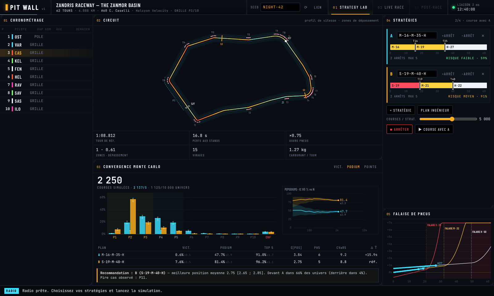

# PIT WALL

**Centre de commandement de stratégie de course.** PIT WALL simule des milliers
de courses (Monte Carlo) sur des circuits générés, compare des stratégies
d'arrêts aux stands avec leur niveau de risque, montre la statistique se
construire en direct, puis joue la course sur une piste animée.

> En course, décider quand s'arrêter et avec quels pneus est un casse-tête de
> probabilités. PIT WALL simule les univers possibles, chiffre chaque option
> (victoire, podium, points, pire 5 %) et montre l'intervalle de confiance se
> resserrer sous vos yeux.

Tout est fictif (pilotes, écuries, circuits générés depuis une seed). Aucune IA
générative : simulation, statistiques, optimisation et gabarits déterministes.



## Prérequis

- Go ≥ 1.24, Node ≥ 22 (npm), `make`
- Optionnel : `golangci-lint` v2 (lint), Docker (image de production)
- Aucune connexion Internet nécessaire à l'exécution (polices embarquées).

## Lancement

```bash
make dev        # serveur Go :8080 + Vite :5173 (rechargement à chaud)
                # → http://localhost:5173/?seed=NIGHT-42
make run        # build complet, un seul binaire sur :8080
                # → http://localhost:8080/?seed=NIGHT-42
make verify     # lint + types + tests + déterminisme + harness
make e2e        # Playwright contre le vrai binaire
make bench      # courses/s (20 voitures × 50 tours)
docker build -t pitwall . && docker run -p 8080:8080 pitwall
```

CLI (sans interface) :

```bash
cd server
go run ./cmd/pitwall sim -seed NIGHT-42 -sims 5000 M-16-M-35-H S-19-M-40-H H-40-S
go run ./cmd/pitwall verify     # 1 vs 16 goroutines : résultats identiques octet pour octet
go run ./cmd/pitwall bench
```

**URL de démo :** `/?seed=NIGHT-42` — la seed identifie la course
(circuit, pilotes, grille, aléas) : même lien, même course pour tout le monde.
`&cars=20` pour une grille de 20.

## Structure

```
server/                 Go : stdlib + github.com/coder/websocket
  internal/rng          PRNG SplitMix64, sous-flux dérivés (seed, simulation, voiture)
  internal/trackgen     circuits fictifs : géométrie → profil de vitesse → temps, usure, zones, stands
  internal/model        pneus (falaise), carburant, air sale, dépassements, arrêts, pannes
  internal/race         moteur tour par tour ; State = type valeur (instantané = copie)
  internal/montecarlo   N simulations parallèles, agrégats en flux, déterministes
  internal/stats        Wilson, quantiles, IC de la médiane, CVaR
  internal/api          protocole v1, validation stricte, sessions, limites
  cmd/pitwall           serve | sim | verify | bench
web/                    TypeScript strict, Vite, Canvas maison
  src/net               décodeurs, client WS (reconnexion + reprise), store
  src/track src/charts  piste animée, histogramme convergent, entonnoir IC, falaise
  src/ui src/live       chronométrage, stratégies, radio, lecture de course
docs/                   MODELS.md · PROTOCOL.md · ARCHITECTURE.md · PLAN.md · screenshots/
AGENTS.md .opencode/    harness OpenCode : agents, commandes, plugin quality-gate, skill
```

## Démo 2 minutes

Seed `NIGHT-42`, grille de 10. Les étapes marquées *(palier 2/3)* arrivent
avec les paliers suivants (voir `docs/PLAN.md`).

1. **0:00 — Choisir la course.** Ouvrir `/?seed=NIGHT-42`. Le circuit
   *Zandris Raceway* est tracé avec son profil de vitesse (rouge = lent,
   cyan = rapide), ses zones de dépassement Z1…, secteurs et voie des stands ;
   une voiture de référence boucle un tour au rythme du profil. Le chrono
   affiche la grille : vous êtes **CAS**, 3ᵉ, en ambre.
2. **0:15 — Deux stratégies.** A = plan de l'ingénieur (`M-16-M-35-H`),
   B = `S-19-M-40-H`. Glisser un arrêt sur la barre de relais, cliquer un relais
   pour changer de gomme, ou taper la notation. La **falaise de pneus** montre
   les relais sur les courbes d'usure ; le risque passe en rouge si un relais
   dépasse la falaise. Essayer `M-0-H` : refusé avec un message clair.
3. **0:35 — Convergence en direct.** *Simuler* (5 000 univers par stratégie).
   Le compteur défile, l'histogramme des positions « respire » puis se fige,
   les moustaches (IC 95 %) raccourcissent, l'entonnoir P(podium) se resserre
   en 1/√N. Le tableau donne victoire / podium / points ± IC, position moyenne,
   P95, CVaR 5 % et le verdict apparié : « B devant A dans 67 % des univers ».
4. **1:00 — La course.** *▶ Course avec B*. Les voitures roulent en suivant le
   profil de vitesse, laissent une traînée, passent par la voie des stands à
   leur arrêt ; le chrono anime chaque changement de position (vert/rouge),
   meilleur tour en violet ; la radio commente (« Box, box. On passe en dures »).
   Vitesse réglable ×1…×240, pause.
5. **1:25 — Imprévu et recalcul** *(palier 2)* : voiture de sécurité, le moteur
   recalcule « rentrer maintenant : +14 % de victoire », vous décidez.
6. **1:40 — Regret** *(palier 3)* : la décision qui a coûté le plus.
7. **1:50 — Univers parallèle** *(palier 3)* : brancher au tour 30, autre
   décision, deux timelines côte à côte.
8. **2:00 — Partager.** Bouton *LIEN* : l'URL avec la seed reproduit exactement
   la même course chez n'importe qui. Fermer l'onglet en pleine course et le
   rouvrir : la session reprend la course là où elle était.

## Qualité et solidité

- **Déterminisme** : même seed + même entrée ⇒ même sortie, 1 ou 16 goroutines
  (`pitwall verify`, test Go, CI).
- **Propriétés** testées à chaque tour sur des centaines de courses : positions =
  permutation, temps strictement croissant, carburant ≥ 0, ≤ 1 arrêt par tour.
- **Statistique** : IC en 1/√N vérifié ; cas analytique « une voiture sans
  variabilité » = somme exacte des tours.
- **Entrées absurdes** : 36 cas d'attaque sur WebSocket + fuzzing natif Go du
  décodeur et de la validation ; aucune ne tue la connexion.
- **Limites** : 50 000 simulations, 4 stratégies, 1 recherche par session, 4
  calculs serveur, 25 s, 64 Kio, débit limité, annulation au départ du client.
- **Performance** : ≈ 20 k courses/s sur un cœur (20 voitures × 50 tours), 0
  allocation dans la boucle chaude.

## Déploiement

`Dockerfile` multi-étapes (Node → Go → distroless, non-root, vérification de
déterminisme pendant le build). `render.yaml` : blueprint Render (Docker,
health check `/healthz`). Le port est lu dans `PORT`.

## Harness agents (OpenCode)

`AGENTS.md` (vérité du projet, invariants, commandes, interdits) ;
agents `engine` (/server), `frontend` (/web), `redteam` (lecture seule,
écrit uniquement des tests), `reviewer` (lecture seule) ; commandes `/verify`,
`/fuzz`, `/determinism-check`, `/bench`, `/demo` ; plugin
`.opencode/plugins/quality-gate.ts` (format + lint + types après chaque
édition, tests à l'inactivité, commit refusé si rouge) ; skill `model-change`.
Captures : `docs/screenshots/`.
